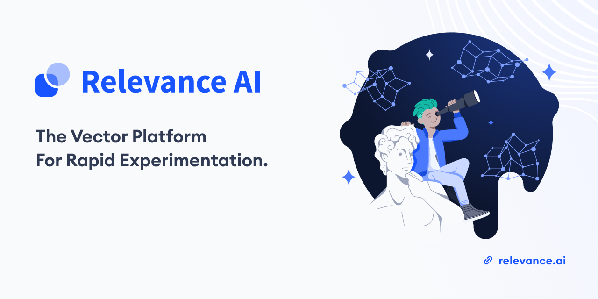

[](https://relevanceai.readthedocs.io/en/latest/?badge=latest)
[](https://img.shields.io/pypi/l/relevanceai)

For guides, tutorials on how to use this package, visit https://docs.relevance.ai/docs.

## 🔥 Features

Features of the library include:
- Quick vector search with free dashboard to preview results
- Vector clustering with support with built-in easy customisation
- Multi-vector search with filtering, facets, weighting
- Hybrid search (weighting exact text matching and vector search together)
... and more! 

You can 


## 🧠 Documentation

There are two main ways of documentations to take a look at:

| API type      | Link |
| ------------- | ----------- |
| Guides | [Documentation](https://docs.relevance.ai/) | 
| Python Reference | [Documentation](https://relevanceai.readthedocs.io/)        |


## 🛠️ Installation

```{bash}
pip install -U relevanceai
```
Or you can install it via conda to:

```{bash}
conda install pip 
pip install -c relevanceai
```

You can also install on conda (only available on Linux environments at the moment): `conda install -c relevance relevanceai`.

## ⏩ Quickstart

### Login into your project space

```{python}
from relevanceai import Client 

client = relevanceai.Client(<project_name>, <api_key>)
```

This is a data example in the right format to be uploaded to relevanceai. Every document you upload should:
- Be a list of dictionaries
- Every dictionary has a field called _id
- Vector fields end in _vector_

```{python}
docs = [
    {"_id": "1", "example_vector_": [0.1, 0.1, 0.1], "data": "Documentation"},
    {"_id": "2", "example_vector_": [0.2, 0.2, 0.2], "data": "Best document!"},
    {"_id": "3", "example_vector_": [0.3, 0.3, 0.3], "data": "document example"},
    {"_id": "4", "example_vector_": [0.4, 0.4, 0.4], "data": "this is another doc"},
    {"_id": "5", "example_vector_": [0.5, 0.5, 0.5], "data": "this is a doc"},
]
```

### Upload data into a new dataset
The documents will be uploaded into a new dataset that you can name in whichever way you want. If the dataset name does not exist yet, it will be created automatically. If the dataset already exist, the uploaded _id will be replacing the old data.

```{python}
client.insert_documents(dataset_id="quickstart", docs=docs)
```

### Perform a vector search

```{python}
client.services.search.vector(
    dataset_id="quickstart", 
    multivector_query=[
        {"vector": [0.2, 0.2, 0.2], "fields": ["example_vector_"]},
    ],
    page_size=3,
    query="sample search" # Stored on the dashboard but not required
```

## 🚧 Development

### Getting Started
To get started with development, ensure you have pytest and mypy installed. These will help ensure typechecking and testing.

```{bash}
python -m pip install pytest mypy
```

Then run testing using:

Make sure to set your test credentials!

```{bash}
export TEST_PROJECT = xxx 
export TEST_API_KEY = xxx 

python -m pytest
mypy relevanceai
```

## 🧰 Config

The config contains the adjustable global settings for the SDK. For a description of all the settings, see here.

To view setting options, run the following:

```{python}
client.config.options
```

The syntax for selecting an option is section.key. For example, to disable logging, run the following to modify logging.enable_logging:

```{python}
client.config.set_option('logging.enable_logging', False)
```

To restore all options to their default, run the following:

### Changing the base URL

You can change the base URL as such: 

```{python}
client.base_url = "https://.../latest"
```

You can also update the ingest base URL: 

```{python}
client.ingest_base_url = "https://.../latest
```
