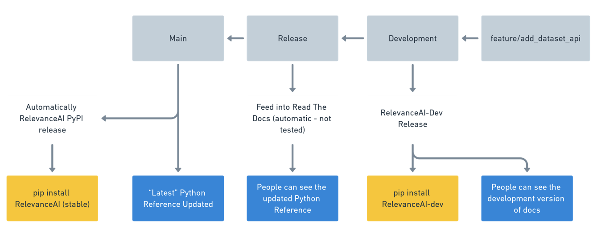

# Releases 

## How to do a release 

If you need to do a release, ensure all changes are reflected in `dev` branch. 
Also make sure that the changes have been manually tested!

An example of our release workflow:

If they have been manually tested, proceed to do the following: 

### Step 1: Updating the version

- In `relevanceai.__init__.py` update the version from `0.28.1` to `0.28.2` or whatever version you need it to be.

### Step 2: Updating Changelog

- On the Github repository home page (https://github.com/RelevanceAI/RelevanceAI), click on "releases"
- Select 'Choose a Tag'
- Select 'Find or Create New Tag'
- Type in new version id e.g. 'v0.28.n + 1'
- Make sure Target is development
- Make sure Release Title is the same as the new version
- Click on Auto-generate release notes
- Copy and paste the relevant changelogs into `docsrc/source/changelog.rst`
- Check out a new branch from development, commit the changes and then push
- Submit a PR and wait for tests to run

### Step 3: Creating Documentation

- Go to https://relevanceai.readthedocs.io/en/latest/
- Click on Read the Docs in the bottom left corner, and check to make sure the new version is listed.

### Step 4: Releasing `Relevance AI` package
- By this time, the tests will be close to done
- Once passed, Merge this PR, this will trigger a Github action that will update the package.

TODO: Document how to release Conda packages (currently in the works).
